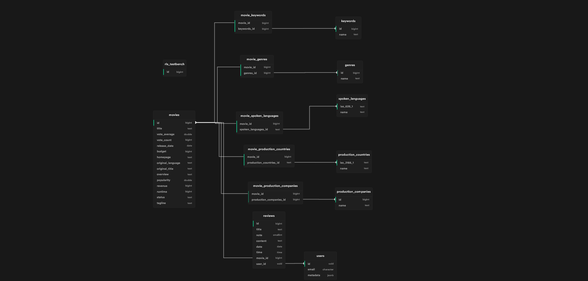

## 🌎 Local Development

### Prerequisites

    - [Node.js](https://nodejs.org/en/) (✅v18.x.x)
    - [NPM](https://www.npmjs.com/) (✅v9.x.x)
    - [Yarn](https://yarnpkg.com/) (❌untested)
    - [pnpm](https://pnpm.io/) (❌untested)

### Development

Add a `.env.local` file similar to the following:

> We need a privileged API key for the `supabase` client to work.
> Because we are going to use the full CRUD operations (Update and Delete are unaccessible to the default anon role)

```bash
# .env.local
NEXT_PUBLIC_SUPABASE_URL=<your supabase url>
NEXT_PUBLIC_SUPABASE_ANON_KEY=<priviledged API key>
```

```bash
npm run dev
# or
yarn dev
# or
pnpm dev
```

You can now open [http://localhost:3000](http://localhost:3000) with your browser to see the result.

## Data Model


> Made with [Supabase Schema](https://supabase-schema.vercel.app/) made by [zernonia](https://github.com/zernonia)
